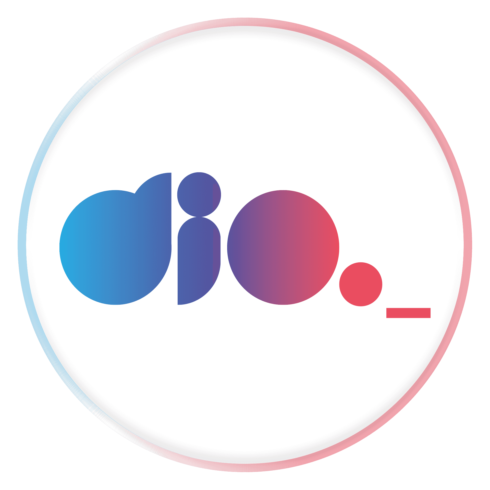

# Bootcamp Santander Fullstack Dev. DIO

Repositório dos desafios de projeto do bootcamp. Fique a vontade para colaborar!

##  <code></code>Desafios de projeto:

### <code></code>Desafio de projeto 01:  <code></code>

- Criando seu primeiro repositório no GitHub para compartilhar seu progresso. 

### <code></code>Desafio de projeto 02:

- Recriando a pagina inicial do Instagram.

### <code></code>Desafio de projeto 03:

- Introdução prática ao TypeScript.

### <code></code>Desafio de projeto 04:

- Como criar um front-end de um e-commerce utilizando Angular.

### <code></code>Desafio de projeto 05: 

- Criando um banco digital com Java e orientação a objetos.

### <code></code>Desafio de projeto 06: 

- Explorando padrões de projetos na prática com Java.

### 

Copyright © 2022 giomartins12

